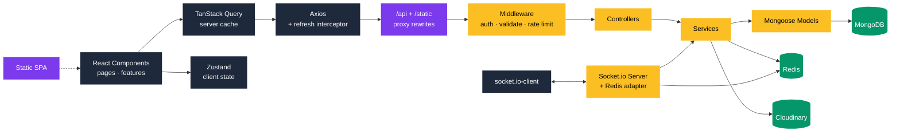
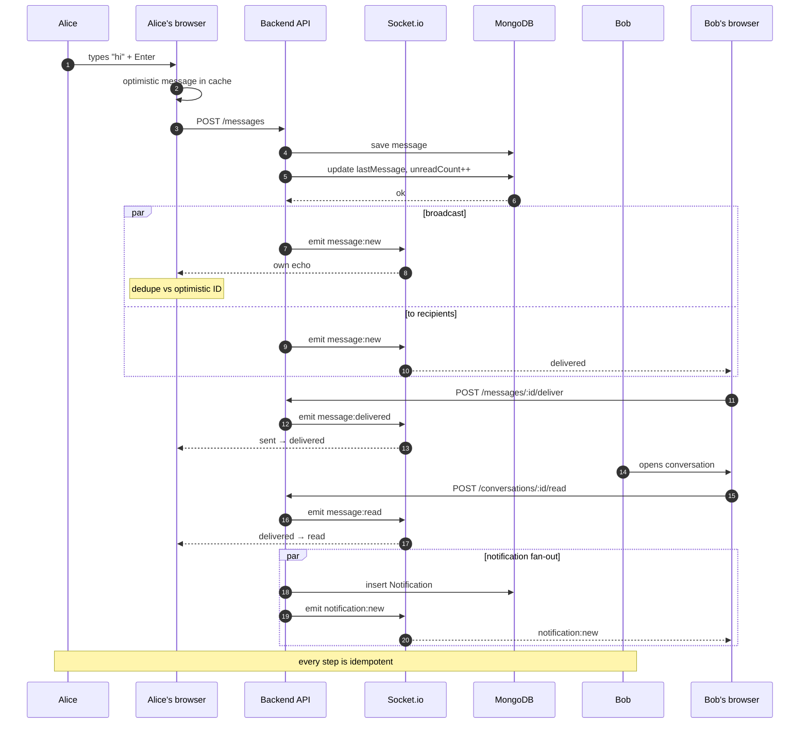

<div align="center">

# RealTime Chat Web

> A modern, real-time chat frontend built with React, Vite, TypeScript, TailwindCSS, and Socket.io. Ships with live messaging, typing indicators, presence, read receipts, reactions, file uploads, and a themable UI.

[](https://git.io/typing-svg)

[](https://skillicons.dev)

</div>

---

## Why This Exists

Chat UIs are deceptively hard. Optimistic updates fight with server echoes. Virtualized lists break scroll. Presence gets out of sync across tabs. Read receipts race with message sends. Most tutorials skip all of that.

This is the frontend I'd ship if I had to maintain it. Every async edge case is handled, every state concern has a clear owner, and the theme system swaps entire palettes by changing CSS variables — nothing more.

It pairs with [realtime-chat-api](https://github.com/UttamSingh809/realtime-chat-api) — a production-grade Node.js backend with the same design philosophy.

---

## What's Inside

**Real-Time Messaging**
- Live delivery via Socket.io with JWT handshake auth
- Optimistic sends with automatic rollback on failure
- Virtualized message list (`react-virtuoso`) — smooth with 10,000+ messages
- Cursor-paginated history, anchored scroll on load-more
- Auto-scroll on new messages with a "Jump to newest" pill when you're scrolled up

**Presence & Feedback**
- Online/away/busy dots driven by a live presence store
- Typing indicators with server-enforced auto-expiry
- Read receipts — three-state ticks (sent → delivered → read)
- Multi-device safe — the presence store handles multiple tabs per user

**Message Actions**
- Reply, edit (inline), delete-for-me, delete-for-everyone (tombstones persist)
- Emoji reactions with a floating picker (no layout shift)
- Star, pin, forward
- Full-text search across your conversations

**Conversations**
- DMs (idempotent — reopening an archived one restores it)
- Groups with unique names per user, member roles, promote/demote
- Per-user pin, archive, mute
- Unread badges synced via sockets

**Files**
- Drag-and-drop, click, or paste from clipboard
- Upload progress per file
- Inline previews for images (with lightbox)
- Download cards for documents
- Client-side validation before upload

**Auth**
- Access token in memory, refresh token in HttpOnly cookie
- Silent refresh on app boot
- Automatic retry with backoff on transient failures
- Protected and public route guards

**Theming**
- Full semantic token system — every color is a CSS variable
- Dark mode with `system` / `light` / `dark` preference
- Emerald Modern palette (used here), plus five alternates: Classic Blue, WhatsApp, Modern Dark, Warm Neutral, Ember
- Swap palettes by editing `index.css` — nothing else

**UX Details**
- Responsive from 320px to 4K
- Mobile drawer with swipe-close
- Keyboard shortcuts (Enter to send, Shift+Enter for newline, Esc to close)
- Empty states, loading skeletons, error recovery everywhere
- Toast notifications with themed colors
- WCAG-aware focus rings, ARIA labels

---

## Stack

| Layer | Tech |
|---|---|
| Framework | React 18 + Vite 5 |
| Language | TypeScript (strict) |
| Styling | TailwindCSS + shadcn/ui |
| Server state | TanStack Query v5 |
| Client state | Zustand |
| Routing | React Router v6 |
| Real-time | socket.io-client |
| HTTP | Axios (with refresh interceptor) |
| Forms | React Hook Form + Zod |
| Virtualization | react-virtuoso |
| Icons | lucide-react |
| Toasts | Sonner |
| Tests | Vitest + Testing Library + MSW |

---

## Quick Start

**Prerequisites:** Node 18+, npm 9+, and the [backend API](https://github.com/you/realtime-chat-api) running (or its URL).

```bash
git clone https://github.com/UttamSingh809/realtime-chat-web
cd realtime-chat-web
npm install
cp .env.example .env.local
```

Edit `.env.local`:

```env
VITE_API_URL=http://localhost:5000/api
VITE_SOCKET_URL=http://localhost:5000
VITE_APP_NAME=RealTime Chat
```

Start:

```bash
npm run dev
```

```
VITE v5.x  ready in 400 ms

➜  Local:   http://localhost:5173/
```

**Backend must have `CORS_ORIGIN` including `http://localhost:5173`.**

---

## Architecture



**The rule that keeps this maintainable:**

- **Server data** → TanStack Query (conversations, messages, notifications)
- **Client state** → Zustand (auth token, theme, presence, UI toggles)
- **URL state** → React Router (active conversation, filters)
- **Sockets** → invalidate caches and push updates. They never fetch.

That separation is why nothing flickers, nothing double-renders, and nothing goes stale.

---

## Project Layout

```
src/
├── api/                Typed API client + interceptors (auth, users, conversations, messages, files, notifications)
├── components/
│   ├── ui/             shadcn/ui primitives
│   ├── chat/           MessageBubble, Composer, reactions, status icons
│   ├── sidebar/        Conversation list, header, footer
│   ├── layout/         AppLayout, MainContent, mobile drawer
│   └── common/         ErrorBoundary, empty states, skeletons
├── features/
│   ├── auth/           Login, register, refresh, guards
│   ├── conversations/  List, create dialog, room management, pin/archive/mute
│   ├── messages/       History, optimistic sends, actions, reactions, delivery
│   ├── files/          Upload, previews, lightbox, drag-drop
│   ├── notifications/  Bell, panel, unread count
│   ├── presence/       Live online store
│   ├── settings/       Profile, privacy, appearance, block/mute
│   ├── socket/         Provider, bridge, handlers
│   └── users/          Search, avatar, profile drawer
├── hooks/              Reusable UI + utility hooks
├── lib/                constants, format, queryClient, emoji, palettes
├── pages/              Route-level components
├── providers/          AppProviders, ThemeProvider, QueryProvider, AuthProvider
├── stores/             Zustand stores
├── types/              Domain models + API types
└── routes/             Router configuration
```

---

## Design Decisions Worth Talking About

**One socket per tab, managed by a provider.** Sockets don't live in component state — they live in Zustand, opened once at the app root, closed on logout. Every consumer subscribes through `useSocketEvent` with a ref-backed handler that doesn't re-subscribe on every render.

**Sockets never fetch data — they invalidate caches.** When `message:reaction` arrives, we invalidate the conversation's history query. React Query refetches silently. The UI never flickers. Correctness is guaranteed because the final state always comes from the server.

**Optimistic updates with rollback.** Sending a message appends a `_optimistic: true` bubble instantly. On success, we swap in the real message. On error, we rollback and toast. Optimistic state is marked with `_optimistic` so it's excluded from delivery/read tracking until the server confirms.

**Two-copy presence fix.** The sidebar green dot reads from a live presence store, not the conversation cache. The cache's `user.status` field is a stale snapshot from the last REST fetch. The store updates on every `user:status` event, so dots flip in real time without a refresh.

**Absolute-positioned Virtuoso.** The virtualized list is wrapped in `relative` + `absolute inset-0`. This gives Virtuoso a concrete height regardless of flex quirks above it — the bulletproof way to avoid the "jittery scroll" class of bugs.

**Access token in memory, refresh in HttpOnly cookie.** Never localStorage. Silent refresh on boot with exponential backoff on transient failures (429, 5xx) — only a real 401 logs you out.

**Theme as CSS variables.** Every color token lives in `index.css` under `:root` and `.dark`. Change the palette in one file, the whole app re-themes. No rebuild, no search-and-replace.

---

## Real-Time Event Flow



Every step is idempotent. Duplicate events don't double-count. Out-of-order events don't corrupt state.

## Testing

```bash
npm test                 # one-shot
npm run test:watch       # watch mode
npm run test:coverage    # coverage report
```

Tests use Vitest + Testing Library + MSW. API calls are mocked at the network layer, so components never know the difference. Critical flows covered: auth refresh, optimistic send + rollback, socket event → cache mapping.

---

## Deployment

**Recommended:** Vercel.

```bash
npm run build      # verify locally first
```

Then:

1. Push to GitHub
2. Import the repo on [Vercel](https://vercel.com)
3. Add env vars:
   - `VITE_API_URL=/api`
   - `VITE_SOCKET_URL=` (empty — Socket.io uses current origin)
4. Add `vercel.json` with `/api/*` and `/static/*` proxy rewrites to the backend
5. Deploy

The Vercel proxy makes the frontend and API **same-origin**, which makes HttpOnly cookies work seamlessly — no cross-origin gymnastics, no `SameSite=None` headaches.

**Post-deploy:** update the backend's `CORS_ORIGIN` to include the Vercel URL.

---

## Environment

| Variable | Purpose |
|---|---|
| `VITE_API_URL` | Backend API base URL (or `/api` behind a proxy) |
| `VITE_SOCKET_URL` | Socket.io server URL (empty = current origin) |
| `VITE_APP_NAME` | Displayed in the sidebar header |

Only `VITE_*` prefixed vars are exposed to the browser. Never put secrets here.

---

## Things That Bit Me (and How I Fixed Them)

Documented for anyone building something similar.

**Refresh tokens rotated twice on page load.** React 18 StrictMode double-invokes effects. Two boot refreshes with the same cookie triggered reuse detection on the backend, which revoked all sessions and logged the user out. Fix: a `useRef` guard plus a module-scoped cache — the boot refresh runs once per real mount.

**Scroll jitter on new messages.** The message list grew past the viewport because `flex-1` had `min-height: auto`. The document scrolled instead of the list. Fix: `min-h-0` on every flex column in the chain, and an absolute-positioned Virtuoso with explicit `height: 100%`.

**Reactions duplicated on rapid clicks.** Optimistic updates collided with their own socket echoes, producing counts of 2, 3, or 4 for one click. Fix: the socket handler ignores echoes for the current user — the optimistic state is authoritative. Cross-user reactions still apply normally.

**Presence stuck on one side.** User A saw B online, but B didn't see A. Root cause: the sidebar dot read from the conversation cache, which only updates on refetch. Fix: read from the live presence store instead, and seed it from the cache on first load so dots appear instantly.

**Reactions lingered on tombstones.** Deleting a message for everyone left reaction pills on the "This message was deleted" bubble. Fix: wipe `reactions`, `starredBy`, `isPinned`, `mentions` on `softDeleteForEveryone` — a tombstone is a record, not a message.

**Emoji picker overflowed the viewport.** The category tabs pushed the popover wider than its parent. Fix: `overflow-x-auto` on the tabs, `overflow-y-auto` with a fixed height on the grid, and a hard cap on the container width.

---

## Contributing

PRs welcome. Before submitting:

```bash
npm run typecheck
npm run lint
npm test
npm run build      # verify the production build passes
```

Vercel runs `tsc` as part of `npm run build` and treats unused variables as hard errors — `npm run typecheck` catches those before you push.

---

## License

MIT — use it, fork it, ship it.

---

## About

Built as a portfolio project to demonstrate real-world React patterns: clean state ownership, real-time syncing without races, optimistic UI with rollback, and a theme system that actually scales.

**Backend:** [realtime-chat-api](https://github.com/UttamSingh809/realtime-chat-api) — Node.js + Express + Socket.io + MongoDB + Redis.

If you're hiring frontend engineers, the interesting bits are in `src/features/socket/SocketBridge.tsx`, `src/features/messages/MessageList.tsx` (Virtuoso + auto-scroll), and `src/lib/queryClient.ts`.

---

<div align="center">

**[Live Demo](https://realtime-chat-web-green.vercel.app)** · **[Report Bug](https://github.com/UttamSingh809/realtime-chat-web/issues)** · **[Request Feature](https://github.com/UttamSingh809/realtime-chat-web/issues)**

Built with React, TypeScript, and a lot of patience for edge cases.

</div>
